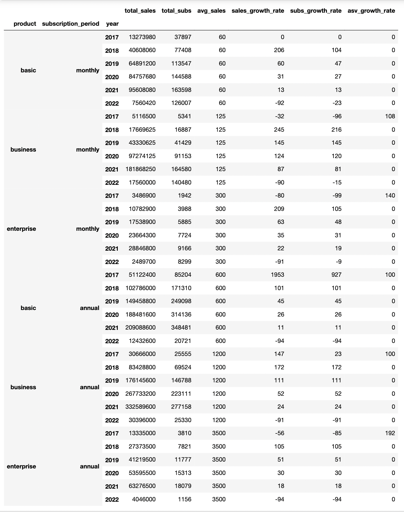

# Company-Customer-Analysis

Analyzing customer behaviour trends from 2017-2021. 

Table of Contents

- [Project Background](#project-background)
- [Executive Summary](#executive-summary)
- [North Star Metrics and Dataset Overview](#north-star-metrics-and-dataset-overview)
- [Insights Deep-Dive](#insights-deep-dive)
    - [Sales Trends and Growth Rates](#sales-trends-and-growth-rates)
    - [Product Performance](#product-performance)
    - [Retention and Churn](#retention-and-churn)
- [Recommendations](#recommendations)
- [Assumptions and Caveats](#assumptions-and-caveats)

***
# Project Background

This project analyzes customer subscription data to identify key sales trends, evaluate retention rates, and assess product performance across various plans, periods, and customer types. The dataset was enhanced with randomized values to increase complexity and depth of analysis. The goal is to deliver actionable insights into customer behaviour, enabling the company to optimize product offerings, enhance customer engagement through loyalty programs, and refine marketing strategies for sustained growth.

# Executive Summary
***
Subscription analysis of 1.18 million records across 2017-2022 reveals annual revenue averaging about 432 million annually with about annual subscriptions contributing 71% of sales. Business and Enterprise plans account for about 88 % of total revenue. Though customer retention is a concern as they have a churn rate of 39% and 49% respectively. The company can benefit from optimizing customer retention strategies and possibly creating loyalty programs to prolong customer loyalty, strengthen their market position and drive sustainable growth.   

# North Star Metrics and Dataset Overview
***
## Dimensions
- **customer_info.csv:** This dataset captures demographic information about customers to analyze trends by age and gender. It is used to assess customer segmentation, preferences, and their potential influence on subscription behaviors.
- **customer_product.csv:** This dataset tracks customers' subscription activities, including the product type and their subscription/cancellation dates. It is used to analyze subscription patterns, customer retention, and cancellation trends over time.
- **customer_cases.csv:**: This dataset logs customer interactions, detailing the communication channel and the reason for contact. It is used to analyze customer touchpoints, understand the primary reasons for engagement (e.g., signup, support), and improve service delivery strategies.
- **product_info.csv:**: This dataset provides details about available products, including pricing and subscription types (monthly or annual). It is used to understand product offerings, their pricing impact, and customer preferences for billing cycles.

- **Exported Dataset** This dataset tracks customer subscriptions—including signups, cancellations, pricing, and billing cycles—with randomized product types and synthetic data for deeper churn, revenue, and product performance analysis.

# Insights Deep-Dive
***
### Sales Trends and Growth Rates
-  Averages $518 million in annual sales with 296,764 orders per year.
-  Sales and subscriptions peak in November and December (holiday season) and dip in February and October, indicating clear seasonal trends.
- Sales surged in 2020 due to increased demand during the pandemic but declined by 2022, returning to just above pre-pandemic levels.
- Average Subscription Value (ASV) remains consistent year-round, with slight increases during peak months.
		

## Product Performance

- Basic Plans: Accounted for the majority of subscriptions (77% of total orders) but had the highest refund rate (77%), indicating lower customer retention.

- Business Plans: Contributed 32% of total sales, with a refund rate of 81%, highlighting challenges with customer retention despite strong revenue performance.

- Enterprise Plans: Demonstrated the lowest refund rate (18%) and the highest ASV ($3,500), showing strong customer loyalty and premium value.


## Retention and Churn
- Overall refund rates increased from 60% in 2017 to 98% in 2022, signalling a need for improved retention strategies.
- Monthly subscriptions had higher churn rates compared to annual plans, particularly for Basic and Business products.
- Enterprise plans showed the highest retention, with only 18% refund rates, underscoring their stability and appeal to long-term customers.


# Recommendations

Customer Growth and Retention
	⁃	Leverage Core Customer Insights: Analyze behaviours and preferences of repeat customers to enhance loyalty campaigns. Introduce referral incentives to drive word-of-mouth growth and increase new customer acquisition from existing networks.
	⁃	Revitalize Customer Acquisition: Expand acquisition channels to include social media, influencer partnerships, and affiliate programs. Refine messaging to re-engage past customers and attract new ones.

Maintaining Low Refund Rates
	•	Sustain Successful Practices: Replicate effective strategies from 2021, including detailed product descriptions, stringent quality control, and robust post-purchase support, to maintain low refund rates and meet customer expectations.

# Assumptions, and Caveats
### Questions for Stakeholders Prior to Project Advancement

- **Unmatched Customer Records**: Missing IDs may indicate that only customers who signed up via `support channels` (e.g., troubleshooting, onboarding assistance) are recorded in `customer_case`. This could imply the dataset excludes self-service signups or automated processes.  
  - **Clarifying Questions for Stakeholders**:  
    - Scope of `customer_case data: Is the `customer_case` dataset intentionally limited to customers who interacted with support teams, or is this a data gap?  
      - **Why It Matters**: Confirms whether missing IDs reflect intentional filtering (e.g., support interactions only) or data collection errors.  
    - Definition of "Case": How is a "case" defined? Does it include all customer interactions (e.g., complaints, feature requests) or only specific scenarios?  
      - **Why It Matters**: Ensures alignment between the dataset’s purpose and the project’s analytical goals.  

- **Growth Rate Baseline**: Growth rates start at **0% in Jan 2017**. Is this the first month of operations, or is historical data (pre-2017) missing?  
  - **Assumption**: Jan 2017 is treated as the baseline.  
  - **Caveat**: Without prior data, trends may misrepresent true growth trajectories.  

- **Key Clarification**:  
  - **January 2022 Active Subscriptions**: Accounts marked as "active" in January 2022 reflect subscriptions already active *as of December 2021* (i.e., carryover status).  
    - Assumption: No cancellations or new signups occurred between December 2021 and January 2022.  

***
- See my SQL queries in the [SQL file](exploration/ecommerce_analysis.sql).
- See the notebook for data cleaning, visualization, and analysis in the [Python Notebook](exploration/subscription_analysis.ipynb).
